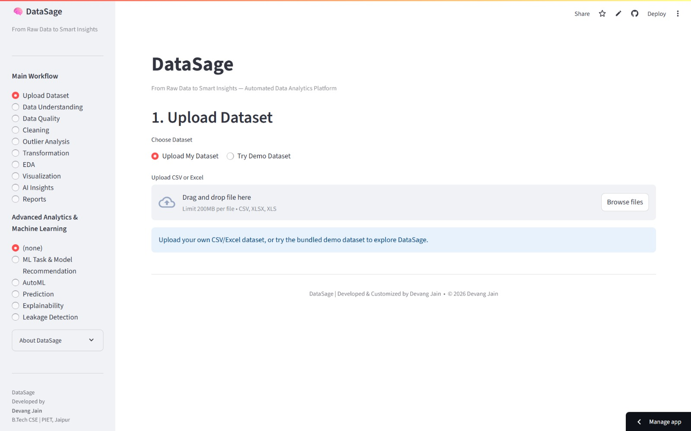
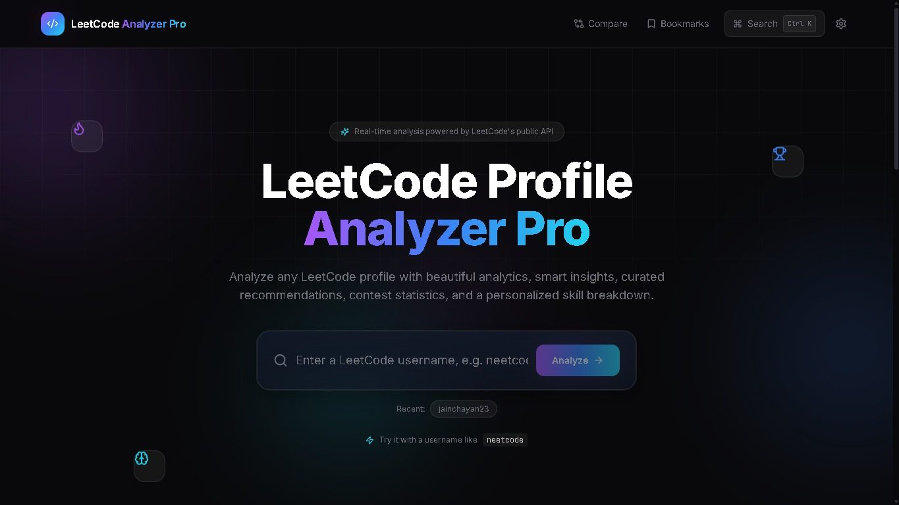
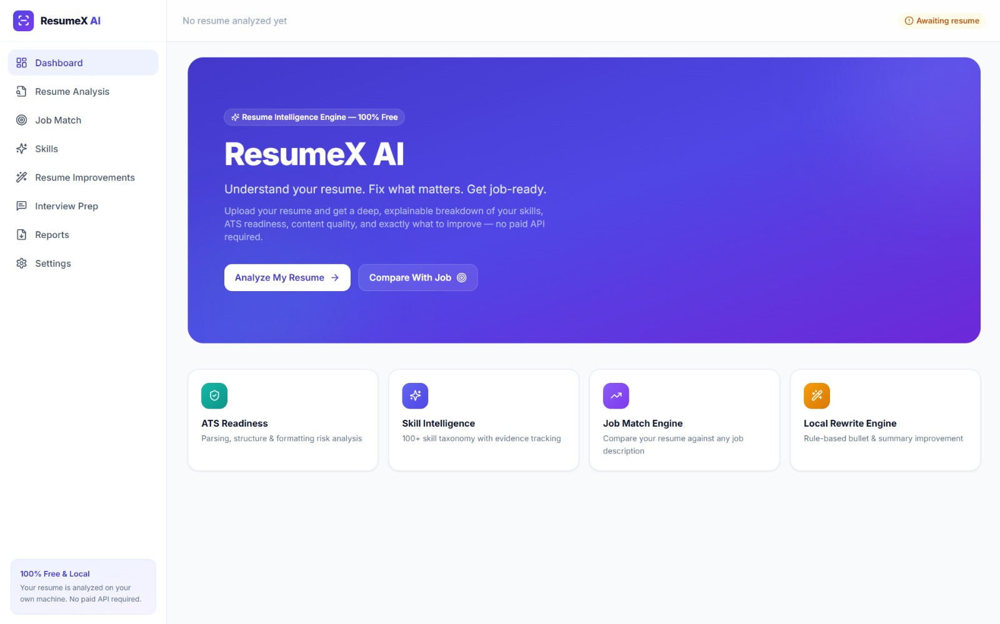
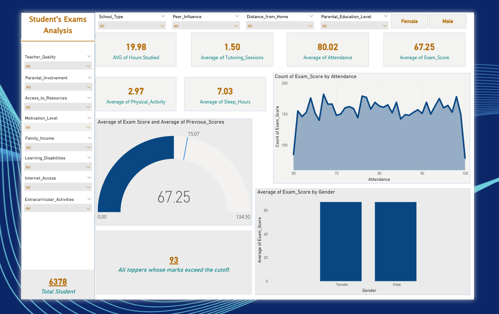

<div align="center">

# 👋 Devang Jain — Personal Portfolio

**A modern, responsive personal portfolio showcasing my work across**
**Data Analytics · Artificial Intelligence · Generative AI · Web Development · Software Development**

<br>

[](#)
[](https://developer.mozilla.org/en-US/docs/Web/HTML)
[](https://developer.mozilla.org/en-US/docs/Web/CSS)
[](https://developer.mozilla.org/en-US/docs/Web/JavaScript)
[](#-responsive-design)

<br>

[About](#-about) •
[Highlights](#-portfolio-highlights) •
[Tech Stack](#%EF%B8%8F-tech-stack) •
[Projects](#-featured-projects) •
[Skills](#-skills) •
[Run Locally](#%EF%B8%8F-run-locally) •
[Contact](#-connect-with-me)

</div>

---

## 📑 Table of Contents

- [About](#-about)
- [Portfolio Highlights](#-portfolio-highlights)
- [Tech Stack](#%EF%B8%8F-tech-stack)
- [Project Structure](#-project-structure)
- [How It Works](#%EF%B8%8F-how-it-works)
- [Education](#-education)
- [Experience](#-experience)
- [Featured Projects](#-featured-projects)
- [More Projects](#-more-projects)
- [Skills](#-skills)
- [Run Locally](#%EF%B8%8F-run-locally)
- [Customization](#-customization)
- [Contact Form](#-contact-form)
- [Deployment](#-deployment)
- [Responsive Design](#-responsive-design)
- [Accessibility & UX](#-accessibility--ux)
- [Future Improvements](#-future-improvements)
- [Connect With Me](#-connect-with-me)
- [License](#-license)

---

## 👋 About

Hi, I'm **Devang Jain**, a Computer Science & Engineering undergraduate at **Poornima Institute of Engineering & Technology, Jaipur**.

My work sits at the intersection of **data and intelligent systems**. I enjoy transforming real-world data into meaningful dashboards and insights, while also building practical applications using Generative AI, LLMs, and modern web technologies.

### 🎯 Current Focus

| | | |
|:---|:---|:---|
| 📊 **Data Analytics** & Data Visualization | 🤖 **Artificial Intelligence** & Generative AI | 🧠 **LLMs, RAG** & Multimodal AI |
| 🌐 **Frontend** & Full-Stack Web Development | 💻 **Software Development** | 📈 Building **practical, user-focused** projects |

---

## ✨ Portfolio Highlights

| 🎨 Design & Interface | ⚙️ Functionality | ♿ Experience |
|:---|:---|:---|
| Clean, modern and responsive UI | Dynamic education, experience, skills and project sections | Reduced-motion accessibility support |
| Fully responsive across desktop, tablet and mobile | Resume access directly from the portfolio | Smooth scrolling navigation |
| Scroll-reveal animations | Social profile integration | Active navigation / scroll-spy |
| Mobile hamburger navigation | Project cards with GitHub and live-demo links | Centralized configuration through a single JavaScript file |
| | Contact form powered by EmailJS | No build system or framework required for the portfolio itself |

---

## 🛠️ Tech Stack

### Core

| Area | Technologies |
|:---|:---|
| **Markup** |  |
| **Styling** |  |
| **Programming** |  |
| **Fonts** | Manrope, Sora |
| **Icons** | Inline SVG |
| **Contact Form** | EmailJS |
| **Hosting** | Compatible with static hosting platforms |

### Development Tools


---

## 📂 Project Structure

```text
Portfolio/
│
├── README.md
├── index.html
│
├── css/
│   └── style.css
│
├── js/
│   ├── config.js
│   └── main.js
│
└── assets/
    ├── images/
    │   ├── BeautyCare.png
    │   ├── ChatAssistant.png
    │   ├── Coffee.png
    │   ├── DataSage.jpeg
    │   ├── icon.jpg
    │   ├── LeetcodeProfileAnalyzer.jpeg
    │   ├── Netflix.png
    │   ├── ResumeX_AI.jpeg
    │   ├── Socials.png
    │   ├── Student_Exam_Performance.png
    │   └── Travel.png
    │
    └── resume/
        └── Resume.pdf
```

---

## ⚙️ How It Works

The portfolio follows a simple **configuration-driven architecture**.

Instead of hard-coding all portfolio data into the HTML, most personal information is maintained inside `js/config.js`, which contains:

| | | |
|:---|:---|:---|
| Personal information | Social links | Resume path |
| Education | Experience | Skills |
| Featured projects | Other projects | EmailJS configuration |

`js/main.js` reads this configuration and dynamically renders the relevant sections of the website.

### 📁 Main Files

| File | Purpose |
|:---|:---|
| **`index.html`** | Contains the semantic structure and main sections of the portfolio. |
| **`css/style.css`** | Contains the complete visual design, responsive layouts, animations, cards, navigation and component styling. |
| **`js/config.js`** | Acts as the central content/configuration file. |
| **`js/main.js`** | Handles dynamic rendering, navigation, scroll behavior, animations, links and the contact form. |

---

## 🎓 Education

| Degree | Institute | Location | Duration |
|:---|:---|:---|:---:|
| **B.Tech — Computer Science & Engineering** | Poornima Institute of Engineering & Technology | Jaipur, Rajasthan | 2023 — 2027 |
| **Higher Secondary Education** | Maa Bharti Sr. Secondary School | Kota, Rajasthan | 2021 — 2023 |

---

## 💼 Experience

### 📊 Data Analytics Intern
**CodeSpazio Solutions Pvt. Ltd.** · `June 2026`

Worked on data analysis and visualization to generate actionable insights and support data-driven decision-making.

> **Tech / Skills:** `Python` `Pandas` `NumPy` `Data Visualization` `Power BI` `Excel`

---

### 🎨 UI/UX Developer Intern
**Euonus IT Pvt. Ltd.** · `July 2025`

Worked on user-friendly wireframes and prototypes focused on improving interface usability and overall user experience.

> **Tech / Skills:** `Wireframing` `Prototyping` `UI/UX Design` `HTML` `CSS`

---

### 🌐 Frontend Developer Intern
**Vilsa Technologies Pvt. Ltd.** · `July 2024`

Developed responsive and interactive web interfaces using modern frontend technologies.

> **Tech / Skills:** `HTML` `CSS` `JavaScript` `Responsive Design` `REST APIs`

---

## 🚀 Featured Projects

### 1️⃣ DataSage



**Category:** `Data Analytics / AI`

An automated EDA and ML recommendation platform that performs data-quality analysis and cleaning, then recommends suitable machine-learning models using AutoML and feature importance.

**Tech Stack:** `Python` `Pandas` `Streamlit` `AutoML` `Scikit-learn`

[](https://github.com/devangjain999/DataSage)
[](https://datasage-analysis.streamlit.app/)

---

### 2️⃣ LeetCode Profile Analyzer



**Category:** `Web Development / Data Visualization`

A premium, animated LeetCode profile analyzer providing real-time statistics, skill breakdowns, contest tracking and side-by-side profile comparison.

**Tech Stack:** `React.js` `Vite` `Tailwind CSS` `Node.js` `Express.js` `Recharts`

[](https://github.com/devangjain999/Leetcode-Profile-Analyzer)
[](https://leetcode-profile-analyzer-client.vercel.app/)

---

### 3️⃣ ResumeX AI



**Category:** `AI / Generative AI`

An AI-powered resume analyzer designed to evaluate ATS compatibility, detect skills and generate professional resume reports.

**Tech Stack:** `Python` `Streamlit` `pdfplumber` `PyPDF2` `Pandas` `Plotly` `ReportLab`

[](https://github.com/devangjain999/ResumeX-AI)
[](https://resume-x-ai-self.vercel.app/)

---

### 4️⃣ Student Exam Performance Analysis



**Category:** `Data Analytics`

A data analytics project analyzing how factors such as attendance, study hours, motivation and other academic attributes relate to student exam performance.

**Tech Stack:** `Python` `Pandas` `NumPy` `Matplotlib` `Seaborn` `Power BI`

[](https://github.com/devangjain999/Student-Exam-Performance-Analysis)

> 📊 Power BI dashboard link can be added in `js/config.js`

---

## 📌 More Projects

| Project | Category | Technologies | Links |
|:---|:---:|:---|:---|
| **Netflix Data Analysis** | Data Analytics | Python, Pandas, Power BI, Jupyter Notebook | [GitHub](https://github.com/devangjain999/Netflix-Data-Analysis) |
| **Chat-Assistant** | Web Development | HTML5, CSS3, JavaScript | [GitHub](https://github.com/devangjain999/Chat-Assistant) · [Demo](https://chat-assistant-gray.vercel.app/) |
| **Coffee-Creation** | Web Development | HTML5, CSS3 | [GitHub](https://github.com/devangjain999/Coffee-Creation) · [Demo](https://coffee-creation.vercel.app/) |
| **Travel Website** | Web Development | HTML5, CSS3, JavaScript | [GitHub](https://github.com/devangjain999/Travel-Website) · [Demo](https://travel-website-blue-alpha.vercel.app/) |
| **BeautyCare Ecommerce Site** | Web Development | HTML5, CSS3, JavaScript | [GitHub](https://github.com/devangjain999/BeautyCare-Ecommerce-Site) · [Demo](https://beauty-care-ecommerce-site.vercel.app/) |
| **Social-Links Platform** | Web Development | HTML5, CSS3, JavaScript | [GitHub](https://github.com/devangjain999/Social-Links) · [Demo](https://allsociallinks.vercel.app/) |

---

## 🧰 Skills

| Category | Skills |
|:---|:---|
| 💻 **Programming** | `Python` `JavaScript` `SQL` |
| 📊 **Data Analytics** | `Pandas` `NumPy` `Power BI` `Power Query` `Excel` `Jupyter Notebook` `Matplotlib` `Seaborn` |
| 🌐 **Web Development** | `HTML` `CSS` `JavaScript` `React.js` `Node.js` `Express.js` |
| 🤖 **AI & Generative AI** | `Generative AI` `LLMs` `RAG` `Multimodal LLM` |
| 🛠️ **Tools** | `Git` `GitHub` `VS Code` `Git Bash` |

---

## 🖥️ Run Locally

This is a static portfolio, so **no `npm install` or build command is required**.

### 1. Clone the repository

```bash
git clone <YOUR_PORTFOLIO_REPOSITORY_URL>
cd Portfolio
```

### 2. Open the project

You can open `index.html` directly in a browser.

For a better development experience, use **VS Code + Live Server**.

### 3. Using Live Server

1. Open the project in VS Code.
2. Install the **Live Server** extension.
3. Right-click `index.html`.
4. Select **Open with Live Server**.

---

## 🔧 Customization

Most portfolio content can be updated from `js/config.js`.

You can update:

```javascript
name
location
email
phone
links
education
experience
skills
featuredProjects
otherProjects
emailjs
```

This makes it easy to update the portfolio without modifying the main HTML structure.

---

## 📧 Contact Form

The contact form uses **EmailJS**. The configuration is located in `js/config.js`:

```javascript
emailjs: {
  publicKey: "...",
  serviceId: "...",
  templateId: "..."
}
```

If the EmailJS configuration is unavailable or invalid, the portfolio gracefully displays a message asking visitors to contact via email instead.

> [!NOTE]
> **Security note:** EmailJS browser-side public keys are intended to be used client-side. Still, keep account-level secrets/private credentials out of the repository and configure EmailJS restrictions/rate limits where appropriate.

---

## 🌐 Deployment

Because this is a static HTML/CSS/JavaScript project, it can be deployed using services such as:


### GitHub Pages

1. Push the project to GitHub.
2. Open the repository's **Settings**.
3. Go to **Pages**.
4. Select the deployment source/branch.
5. Save the configuration.
6. GitHub will provide the published website URL.

---

## 📱 Responsive Design

The portfolio is designed to adapt to different screen sizes:

| 🖥️ Desktop | 💻 Laptop | 📟 Tablet | 📱 Mobile |
|:---:|:---:|:---:|:---:|

The CSS includes responsive breakpoints for navigation, project grids, skill cards, forms and hero actions.

---

## ♿ Accessibility & UX

The portfolio includes several usability-focused details:

- ✅ Semantic HTML structure
- ✅ Skip-to-content link
- ✅ Accessible navigation controls
- ✅ ARIA labels for social icons
- ✅ Mobile menu state handling
- ✅ Keyboard-friendly interactive elements
- ✅ Reduced-motion support
- ✅ Responsive layouts
- ✅ Lazy-loaded project images

---

## 📈 Future Improvements

Potential future enhancements include:

- [ ] Add a dedicated blog / articles section
- [ ] Add project filtering by category
- [ ] Add GitHub API integration for live repository statistics
- [ ] Add more detailed case studies for major projects
- [ ] Add a downloadable project portfolio PDF
- [ ] Add automated analytics
- [ ] Add a dedicated achievements/certifications section
- [ ] Replace remaining placeholder dashboard links with actual public Power BI URLs

---

## 🤝 Connect With Me

[](https://github.com/devangjain999)
[](https://www.linkedin.com/in/devangjain999)
[](https://leetcode.com/u/devangjn999/)
[](mailto:devangjainwork@gmail.com)

---

## 📄 License

This portfolio is a personal project created for showcasing my education, experience, skills and projects.

If you use the structure or design as inspiration, please create your own content, branding and assets.

---

<div align="center">

### Built with HTML, CSS & JavaScript

**Devang Jain · Jaipur, Rajasthan, India**

⭐ *If you like this portfolio, consider giving the repo a star!*

</div>
